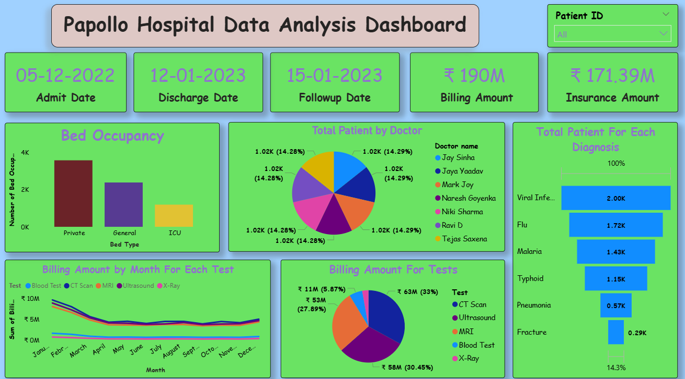

# Papollo Hospital Data Analysis - Power BI

## 📌 Overview
This project is a *hospital data analysis dashboard* built in Power BI using a sample dataset.  
The purpose of the project was to explore how data visualization can help in understanding hospital operations like billing, patient diagnosis, doctor performance, and bed occupancy.  

---

## 📊 Dashboard Preview

---

## 🔹 Key Insights
- *Total Billing Amount:* ₹190M  
- *Total Insurance Amount:* ₹171.39M  
- *Billing by Test Type:*  
  - CT Scan → ₹63M (33%)  
  - Ultrasound → ₹58M (30.45%)  
  - MRI → ₹53M (27.89%)  
  - Blood Test → ₹11M (5.87%)  
  - X-Ray → smaller contribution  
- *Bed Occupancy:* General and Private beds show higher usage compared to ICU  
- *Patients by Doctor:* Patient distribution was fairly even across 7 doctors (~14.3% each)  
- *Diagnosis Insights:*  
  - Viral Infection → 2K patients  
  - Flu → 1.72K  
  - Malaria → 1.43K  
  - Typhoid → 1.15K  
  - Pneumonia → 0.57K  
  - Fracture → 0.29K  

---

## 📂 Files
- Papollo_Hospital.pbix → Power BI project file  
- papollo_data_analysis.pdf → Exported PDF dashboard  
- papollo_hospital.png → Screenshot for README  

---

## 🚀 How to Use
1. Download the .pbix file.  
2. Open it in *Power BI Desktop*.  
3. Interact with the dashboard filters to explore the insights.  

---

## 🎯 Learnings
- Practiced KPI creation (Billing, Insurance, Patients, Tests).  
- Gained experience with healthcare-related data.  
- Learned to represent large billing & diagnosis data clearly with visuals.  
- Improved dashboard storytelling with Power BI.  

---

